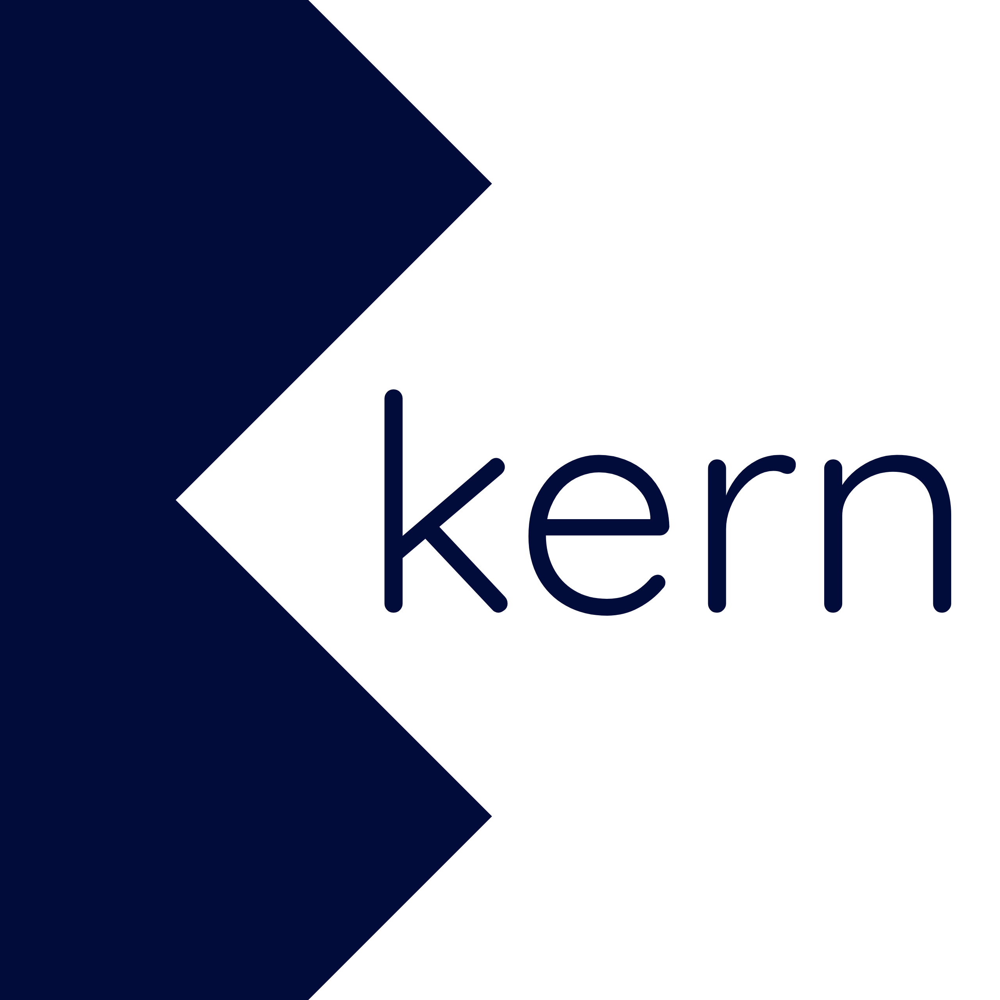

<p align="center">
  
</p>

# Kern

<!-- Language & platform -->
[](https://kotlinlang.org/)
[](https://openjdk.org/)
[](https://developer.android.com/)
<!-- UI -->
[](https://developer.android.com/jetpack/compose)
[](https://m3.material.io/)
<!-- Build & libraries -->
[](https://gradle.org/)
[](https://poi.apache.org/)
[](https://opencsv.sourceforge.net/)
<!-- Project -->
[](https://github.com/verycareful/kern/tags)
[](LICENSE)
[](.)

A privacy-first, fully offline, open-source Android document toolkit.
No cloud sync. No data collection. No network access. Completely free. AGPL-3.0.

Kern is in early alpha.

## What Kern does

Kern integrates with Android's "Open with" system, so any file on your device - in Downloads, Documents, or anywhere else - can be opened directly in Kern. There is no separate app folder and no syncing. Kern reads and writes files in place; your files stay yours, on your device.

## Document formats

Kern works with common document types:

- Spreadsheets - `.xlsx`, `.xls`, `.csv`
- Documents - `.docx`
- Presentations - `.pptx`
- PDF - `.pdf`
- EPUB - `.epub`

## Tech stack

- **Language:** Kotlin + Jetpack Compose
- **Office formats:** Apache POI (xlsx, docx, pptx) + OpenCSV
- **PDF engine:** MuPDF via the [Qyra](https://github.com/zParik/Qyra) Rust JNI/NDK bridge (GPL-3.0)
- **License:** AGPL-3.0
- **Min Android API:** 26 (Android 8.0+)

## Permissions

Kern requests:
- `READ_EXTERNAL_STORAGE` / `WRITE_EXTERNAL_STORAGE` (older Android versions)
- `READ_MEDIA_*` (Android 13+)
- `MANAGE_EXTERNAL_STORAGE` - guided toward Documents and Downloads
- "Open with" intent filters for supported document types

No network permissions. Ever.

## Project structure

```
kern/
├── src/
│   ├── browser/          # File browser + "Open with" intent handling
│   ├── editors/          # One module per format (csv, excel, word, pdf, pptx)
│   ├── pdf-bridge/       # Native PDF bridge (JNI/NDK)
│   └── shared/           # Theme, shared UI, utilities
├── res/                  # Android resources (launcher icon, themes, strings)
├── tests/                # Mirrors src/ structure
├── docs/                 # Architecture notes
├── brand/                # Logo assets
├── config/               # Lint configuration
├── scripts/              # Dev tooling
└── sample-files/         # Sample documents
```

## Versioning

This project uses an `A.B.C.D` version scheme. Released versions are tagged in git: the current version is whatever the version badge above shows (see the [tags](https://github.com/verycareful/kern/tags)).

## Getting started

```bash
git clone https://github.com/verycareful/kern.git
```

Open the folder in Android Studio and press Run. Studio provisions the matching Gradle version (8.10.x, pinned in `gradle/wrapper/gradle-wrapper.properties`) automatically. Prebuilt debug APKs are also attached to each [GitHub Release](https://github.com/verycareful/kern/releases) and to the CI run artifacts.

See [docs/architecture.md](docs/architecture.md) for system design and [CONTRIBUTING.md](CONTRIBUTING.md) for contributor guidelines.

## License

AGPL-3.0. See [LICENSE](LICENSE).

PDF engine: MuPDF via [Qyra](https://github.com/zParik/Qyra) (GPL-3.0, compatible with AGPL-3.0).
